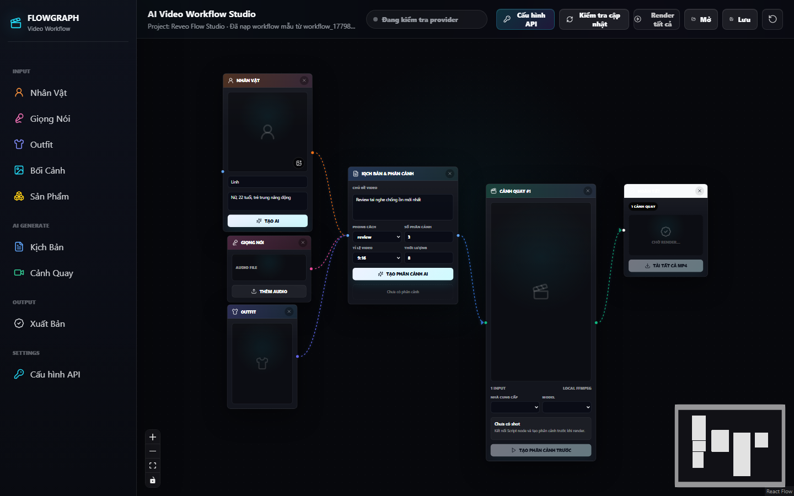
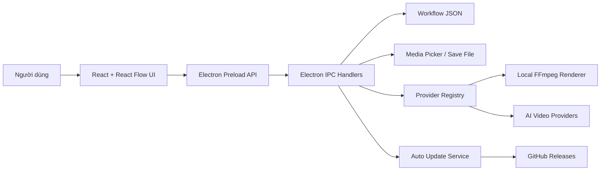

# Video Flow

<div align="center">
  
  <br />
  <br />
  <strong>Desktop studio để thiết kế, render và quản lý workflow video AI theo dạng node graph.</strong>
  <br />
  <br />
  <a href="https://github.com/nguyengiadat03/reveo-flow/releases/latest">
    
  </a>
  
  
  
</div>

## Tổng quan

**Video Flow** là ứng dụng desktop Windows giúp xây dựng quy trình sản xuất video bằng giao diện kéo thả node. Người dùng có thể nhập kịch bản, nhân vật, giọng nói, outfit, bối cảnh, asset sản phẩm, sau đó nối các thành phần thành scene và xuất bản video.

Ứng dụng được xây dựng bằng **Electron**, **React**, **Vite**, **React Flow** và tích hợp renderer local bằng **FFmpeg**. Hệ thống cũng đã chuẩn bị lớp provider cho các dịch vụ AI video như Gemini/Veo, Kling, Runway, Pika và Custom Provider.

## Tải và cài đặt

| Mục đích | File |
| --- | --- |
| Cài đặt cho người dùng Windows | [`Video-Flow-Setup-1.0.0.exe`](https://github.com/nguyengiadat03/reveo-flow/releases/download/v1.0.0/Video-Flow-Setup-1.0.0.exe) |
| Chạy nhanh không cần cài đặt | [`Video-Flow-Portable-1.0.0.exe`](https://github.com/nguyengiadat03/reveo-flow/releases/download/v1.0.0/Video-Flow-Portable-1.0.0.exe) |
| Trang release mới nhất | [GitHub Releases](https://github.com/nguyengiadat03/reveo-flow/releases/latest) |

> Khuyến nghị gửi cho người dùng file **Video-Flow-Setup-1.0.0.exe** để cài đặt chính thức. File `latest.yml` và `.blockmap` chỉ dùng cho cơ chế auto-update.

## Tính năng chính

- Thiết kế workflow video bằng node graph trực quan.
- Thêm và kết nối các node: Kịch bản, Nhân vật, Giọng nói, Outfit, Bối cảnh, Sản phẩm, Cảnh quay và Xuất bản.
- Lưu và mở workflow dưới dạng JSON.
- Upload media tham chiếu cho hình ảnh, audio và video trong ứng dụng desktop.
- Render scene bằng Local FFmpeg Mock Renderer để tạo file MP4 nhanh.
- Quản lý API key cục bộ cho từng video provider.
- Hỗ trợ auto-update qua GitHub Releases cho bản cài đặt Windows.
- Đóng gói Windows bằng Electron Builder với NSIS installer và portable build.

## Hình ảnh hệ thống

### Giao diện workspace


### Kiến trúc tổng quan



## Luồng sử dụng

1. Mở ứng dụng **Video Flow**.
2. Thêm các node đầu vào như nhân vật, giọng nói, outfit, bối cảnh hoặc sản phẩm.
3. Tạo node kịch bản và scene.
4. Kết nối node theo đúng luồng sản xuất video.
5. Cấu hình provider hoặc dùng Local FFmpeg.
6. Nhấn **Render tất cả** để render các scene.
7. Lưu workflow hoặc xuất file video hoàn chỉnh.

## Công nghệ sử dụng

| Nhóm | Công nghệ |
| --- | --- |
| Desktop runtime | Electron |
| Frontend | React, TypeScript, Vite |
| Workflow canvas | `@xyflow/react` |
| Icon | `lucide-react` |
| Render local | `ffmpeg-static` |
| Auto update | `electron-updater` |
| Packaging | `electron-builder` |

## Cài đặt môi trường phát triển

Yêu cầu:

- Node.js 20+ khuyến nghị
- npm
- Windows 10/11 để build bản `.exe`

```bash
npm install
```

Chạy giao diện web dev:

```bash
npm run dev
```

Chạy ứng dụng Electron dev:

```bash
npm run electron:dev
```

Build frontend:

```bash
npm run build
```

## Đóng gói ứng dụng

Tạo bản cài đặt Windows:

```bash
npm run dist
```

Tạo bản portable:

```bash
npm run dist:portable
```

Publish bản Windows lên GitHub Releases:

```bash
npm run publish:win
```

Artifact sau khi build nằm trong thư mục `release/`.

## Cấu trúc thư mục

```text
reveo-flow/
├── electron/              # Main process, preload, IPC, provider, updater
├── src/                   # React UI, node components, client services
├── docs/images/           # Ảnh README và tài liệu
├── dist/                  # Output frontend sau khi build
├── release/               # Installer, portable app và update metadata
├── package.json           # Script, dependency và cấu hình electron-builder
└── vite.config.ts         # Cấu hình Vite
```

## Provider render

| Provider | Trạng thái | Ghi chú |
| --- | --- | --- |
| Local FFmpeg | Sẵn sàng | Renderer local, không cần API key |
| Gemini / Veo | Chuẩn bị | Cần nối SDK/API chính thức |
| Kling | Chuẩn bị | Cần endpoint/API chính thức |
| Runway | Chuẩn bị | Cần SDK/API chính thức |
| Pika | Chuẩn bị | Cần endpoint/API chính thức |
| Custom Provider | Chuẩn bị | Dành cho backend tương thích riêng |

## Bảo mật

- API key được lưu cục bộ qua backend Electron.
- Workflow JSON không lưu secret.
- Renderer desktop gọi provider qua IPC, không gọi trực tiếp từ UI web.
- Bản release không nên commit vào Git vì thư mục `release/` đã được ignore.

## Release hiện tại

- Phiên bản: **1.0.0**
- Tag: [`v1.0.0`](https://github.com/nguyengiadat03/reveo-flow/releases/tag/v1.0.0)
- Installer: [`Video-Flow-Setup-1.0.0.exe`](https://github.com/nguyengiadat03/reveo-flow/releases/download/v1.0.0/Video-Flow-Setup-1.0.0.exe)
- Portable: [`Video-Flow-Portable-1.0.0.exe`](https://github.com/nguyengiadat03/reveo-flow/releases/download/v1.0.0/Video-Flow-Portable-1.0.0.exe)

## Tác giả

Phát triển bởi **Rocket Global**.
